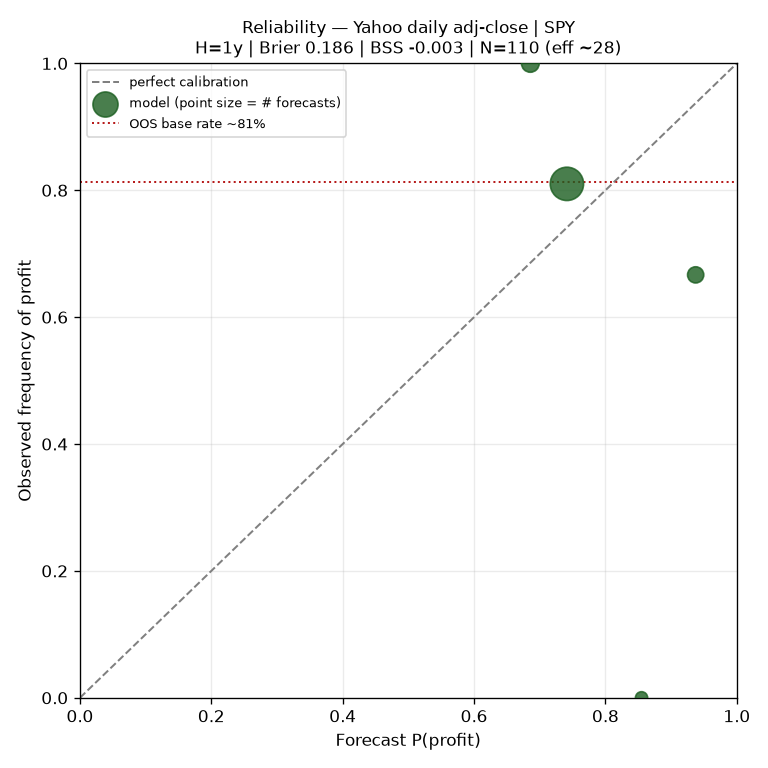

# Block-Bootstrap Portfolio Risk Simulator

A non-parametric risk simulator that estimates the **full distribution of future portfolio outcomes** by block-bootstrapping an asset's own historical returns -- then **validates its own probability forecasts** with an out-of-sample walk-forward calibration backtest.

> **Not investment advice.** No trading, ordering, or live-execution capability of any kind.
> All examples use public tickers. All figures are nominal (not inflation-adjusted).
> Outputs are probabilistic ranges from a historical prior -- never predictions.

---

## Supported Markets

| Market | Tickers | Currency | Risk-free rate | Example |
|---|---|---|---|---|
| **US** (default) | Any NYSE/NASDAQ symbol | `$` (USD) | 4.0% | `SPY`, `VTI`, `AAPL` |
| **India -- NSE** | Append `.NS` | `₹` (INR) | 6.5% | `NIFTYBEES.NS`, `RELIANCE.NS` |
| **India -- BSE** | Append `.BO` | `₹` (INR) | 6.5% | `NIFTYBEES.BO`, `RELIANCE.BO` |

Currency and cash benchmark rate are auto-detected from the ticker suffix. The Streamlit dashboard includes a **Market** toggle (US / India) with pre-populated ticker dropdowns for each market including index ETFs (Nifty 50, Bank Nifty, Nifty Next 50) and major companies (Reliance, TCS, HDFC Bank, Infosys, etc.).

---

## Aim

Most retail "Monte Carlo" portfolio tools draw returns from a fitted Normal distribution and report confident-looking outcome fans. Two things are usually wrong:

1. **The model erases the risk that matters.** Real markets have fat tails, volatility clustering, and crash *sequences*. A Gaussian draw with a single mean/sigma throws all of that away and **understates drawdowns and left-tail loss** -- exactly the quantities a risk tool exists to measure.

2. **Nobody checks if the probabilities are real.** A forecast of "72% chance of profit" is presented with no evidence that things labelled 72% actually happened ~72% of the time.

**This project addresses both:** a non-parametric simulator that preserves real tail behavior, plus a calibration layer that scores the forecasts against realized history -- and reports the result honestly, including when the model shows no edge.

---

## Models & Methods

### Why Block Bootstrap (vs. Parametric Monte Carlo)

| | Parametric MC (Normal) | **Block Bootstrap (this tool)** |
|---|---|---|
| Tails | Thin (Gaussian) -- crashes nearly impossible | **Real** -- replays actual crash days |
| Volatility clustering | None (i.i.d. draws) | **Preserved** within contiguous blocks |
| Cross-asset correlation | Assumed via covariance matrix | **Preserved** by joint date-aligned resampling |
| Distribution assumption | Strong (Normal or Student-t) | **None** -- resamples reality directly |

We use the **circular moving-block bootstrap** (Politis & Romano, 1992): resample contiguous blocks (default 21 trading days, ~1 month) of *real* historical returns and stitch them into thousands of synthetic future paths. Because the sampled material is real return sequences, the simulation inherits the asset's genuine fat tails, volatility clustering, and drift -- no distributional assumption imposed.

### Core Engine (`stock_probability_engine.py`)

**Data layer** -- standard-library only (`urllib`, `json`, `csv`). Pulls dividend/split-adjusted daily closes from Yahoo Finance with explicit `period1`/`period2` parameters (not `range=max`, which Yahoo silently coarsens to quarterly bars). Also accepts any brokerage CSV (Fidelity, Robinhood, Schwab) via auto-detection of date and price columns. No API key, no third-party SDK.

**Bootstrap modes:**

- **Single-series (index or stock):** Circular block bootstrap on one ticker's log-returns. Default is `VTI` (US total market). Single stocks are supported but flagged with a `WEAKER PRIOR` caveat -- a one-name bootstrap is idiosyncratic (earnings, fraud, obsolescence it can't foresee).
- **Era-blended (`--blend`):** Block-level mixing across time windows (default: 5y 40%, 15y 35%, full history 25%). Each simulated month is drawn from one era according to these odds, so a single path can stitch a calm 2017 stretch onto a 2008-style crash block -- the future isn't locked into one regime.
- **Portfolio (multi-asset, `--portfolio`):** Components are inner-joined on common trading dates. **One block-index draw is applied to every asset simultaneously** -- each resampled timestep is a real historical cross-section. This preserves empirical cross-asset correlation exactly, with no Cholesky factorization or Gaussian copula. A QA test confirms joint resampling holds correlation while independent resampling destroys it.

**Outputs per horizon (1/3/5 years):**
- Percentile cone (P5 through P95) of portfolio value
- `P(profit)` -- fraction of simulated futures ending above invested amount
- `P(beats cash)` -- fraction beating a risk-free benchmark
- **VaR / CVaR (Expected Shortfall)** -- left-tail risk at 95% confidence
- **Drawdown distribution** -- worst peak-to-trough dip across all paths
- **Neutral threshold indicator** -- flags P(profit) ABOVE/BELOW a user-set threshold (mechanical comparison, *not* a buy/sell signal)

**Stress testing:** `--haircut` removes a fraction of historical drift to simulate a less rosy regime (0.0 = real history, 1.0 = strip all drift).

### Walk-Forward Calibration (`calibration.py`)

The bootstrap produces internally consistent probabilities (validated by 22 invariant tests). But internal consistency says nothing about whether a "72% chance of profit" is *actually right*. The calibration module checks this via **expanding-window walk-forward backtesting**:

1. Step through history at quarterly intervals (min 5-year training window)
2. At each origin *t*, fit the bootstrap on data available **only up to *t***
3. Forecast P(profit) and terminal-multiple percentiles for horizon H
4. Record what **actually happened** over the next H periods
5. Score the collected (forecast, outcome) pairs

**Scoring metrics:**
- **Brier Score** -- mean squared error of probability forecasts vs 0/1 outcomes
- **Brier Skill Score (BSS)** -- skill vs a naive out-of-sample climatology benchmark. The benchmark at each origin is the frequency of positive H-period returns *within the training window only* (not the full sample -- an earlier version had look-ahead bias here, which was identified and fixed)
- **Reliability curve** -- forecasts bucketed into deciles, predicted probability vs observed frequency. A well-calibrated model sits on the diagonal
- **PIT coverage** -- fraction of realized outcomes below forecast percentiles (P10/P50/P90 should cover ~10/50/90%)

**Honesty safeguards:**
- Origins whose training window holds fewer than 5 non-overlapping H-windows are **excluded** (base rate too unstable to benchmark against)
- Reports both raw origin count AND effective independent N (~span/horizon), since overlapping windows are autocorrelated
- Both model and benchmark are strictly out-of-sample -- no look-ahead

### QA Test Suite (`qa_check.py`)

22 statistical invariant tests across three categories:

**Engine invariants (12 tests):**
- Daily granularity detection (252 periods/year)
- Determinism (identical seed = identical output)
- Unbiased drift (bootstrap mean ~= historical mean)
- Drawdown sign (all max-drawdowns <= 0)
- Scale invariance (P(profit) independent of dollar amount)
- VaR <= CVaR ordering
- CAGR/value internal consistency
- Monotonic P(profit) with horizon (positive-drift asset)
- Drift haircut stress tests (2 checks)
- Error handling (invalid ticker raises cleanly)
- Robustness (short history doesn't crash)

**Portfolio invariants (3 tests):**
- Weights normalize to 1 (explicit and equal-weight specs)
- Joint resampling preserves cross-asset correlation
- Independent resampling destroys correlation (contrast test)

**Calibration scoring invariants (6 tests):**
- Perfect forecast -> Brier 0
- Coin-flip constant 0.5 -> Brier ~0.25
- Base-rate Brier = p(1-p)
- BSS = 0 when model == base rate
- Informative forecaster BSS > 0
- Reliability bucket counts sum to N

### Streamlit Dashboard (`app.py`)

Local-only web UI. Three input modes:
- **Single ticker** -- selectbox dropdown with diversified funds (VTI, VOO, SPY, QQQ, etc.) and individual companies (AAPL, MSFT, NVDA, etc.)
- **Portfolio** -- free-text allocation (`VTI:0.8, QQQ:0.2`)
- **Upload CSV** -- any brokerage export

Features: interactive probability cone chart (Altair), live threshold slider for instant re-evaluation (simulation is cached, only the threshold comparison updates), history diagnostics, window composition breakdown, and risk cards per horizon.

---

## Results

### Calibration -- SPY, 1993-2026



| Horizon | Brier (model) | Brier (OOS benchmark) | **BSS** | Independent N (backtest / full) | Eligible / excluded origins |
|---|---|---|---|---|---|
| 1 year | 0.186 | 0.186 | **-0.00** | ~28 / ~33 | 110 / 0 |
| 3 years | 0.032 | 0.063 | **+0.49** | ~6 / ~11 | 62 / 40 |

**Honest reading:**

- **1-year:** The model is **essentially tied** with a fair out-of-sample base rate (BSS ~= 0). **No demonstrated directional skill, in either direction.** With ~28 effectively independent windows, the error bars are wide -- read this as "no skill demonstrated," not "proven negative skill."

- **3-year:** The "+0.49" is **not real skill**. Excluding early origins leaves only ~6 independent windows, and every one was profitable (realized rate 100%), so any high-leaning forecast scores well. This is an artifact of a small, regime-limited sample, not evidence of predictive ability.

- **Distribution calibration (PIT):** At 1 year, realized outcomes fall below the forecast P10/P50/P90 about 15%/42%/96% of the time (nominal 10/50/90). The left tail is slightly understated and the median slightly optimistic, but the shape is reasonable.

**This calibration result -- no demonstrated directional skill in P(profit) versus a fair out-of-sample base rate -- is precisely why P(profit) is presented as a risk-distribution *indicator*, not a trading signal.** The defensible use of this tool is the **shape of the risk distribution** (drawdown, VaR/CVaR, the percentile cone), not market timing.

---

## Notes

### Design Decisions

- **Index-primary framing.** The tool defaults to `VTI` and steers users toward diversified funds. Single stocks are supported but caveated. This is a deliberate choice: a block-bootstrap prior is statistically legitimate for a broad holding but idiosyncratic for a single name.

- **No auto-trading.** This is a research/analysis instrument with zero order-execution capability. The neutral ABOVE/BELOW threshold indicator replaced an earlier INVEST/PASS framing to avoid any suggestion of trade recommendations.

- **Look-ahead bias fix.** An earlier version scored the model against the full-sample base rate (~80% for SPY), which peeked at future data. Switching to per-origin out-of-sample climatology (training-window-only positive-window frequency) changed the 1-year BSS from -0.16 to -0.003 -- a material correction. Both the fix and the prior bug are documented for transparency.

- **stdlib data layer.** The Yahoo Finance fetch uses only `urllib` and `json` (no `yfinance`, no API key). This keeps the dependency footprint minimal and avoids authentication/rate-limit complexity. The tradeoff: it's more fragile to Yahoo endpoint changes, but the fallback CSV path covers that.

- **Daily rebalancing.** `bootstrap_portfolio` rebalances to constant weights every period (daily for daily data). This is a modeling choice, not a limitation -- it matches the constant-mix strategy that the weight vector implies.

### Known Limitations

1. **Regime change.** The prior is the past. A structurally new regime (rates, inflation, market structure) is not in the sample and cannot be sampled.

2. **Between-block independence.** Stitching independent blocks breaks momentum and long-range autocorrelation across block boundaries. Multi-month trends are not reproduced. This means multi-year tail risk may be **optimistic** (real crashes involve sustained momentum that independent blocks fragment).

3. **Single-asset prior is weak.** Idiosyncratic risk dominates one name. The tool flags this and steers to index/portfolio paths.

4. **Nominal, not real.** No inflation adjustment. At long horizons, real purchasing power differs materially from nominal values.

5. **Small independent sample.** With ~33 years of daily US equity history, there are only ~28 non-overlapping 1-year windows and ~6 non-overlapping 5-year windows. This fundamentally limits how precisely we can validate *any* model's long-horizon forecasts.

6. **No confidence intervals on skill scores.** BSS is reported as a point estimate. With single-digit independent samples at long horizons, the true uncertainty around these scores is substantial.

### Proposed Improvements (Not Yet Implemented)

Tiered model-comparison strategy, scored with CRPS and block-bootstrapped confidence intervals:

- **GARCH-FHS (Filtered Historical Simulation):** Fit a GARCH(1,1) for conditional volatility, then bootstrap the standardized residuals. Edge: short-horizon vol forecasting. Limitation: at multi-year horizons, conditional variance mean-reverts to unconditional -- adding little over plain FHS.

- **HMM Regime-Switching (2-state):** Estimate bull/bear states and transition probabilities. Limitation: ~5-8 regime episodes in 33 years makes parameter estimation fragile and prone to overfitting to 2008 specifically.

- **EVT (Extreme Value Theory, POT/GPD):** Model the left tail beyond a threshold with a Generalized Pareto distribution. Addresses the "blocks fragment sustained crashes" limitation.

- **Scoring:** CRPS (Continuous Ranked Probability Score) for full-distribution evaluation, with block-bootstrapped CIs and Hansen's SPA test for honest model comparison. Frame as **comparison** models, not replacements -- the block bootstrap remains the transparent baseline.

---

## Usage

### Quick Start

```bash
# Install dependencies
pip install -r requirements.txt

# --- US market (default) ---
python stock_probability_engine.py                              # VTI, US total market
python stock_probability_engine.py SPY                          # S&P 500
python stock_probability_engine.py --portfolio "VTI:0.8,QQQ:0.2"  # multi-asset (correlation preserved)
python stock_probability_engine.py AAPL                         # single stock (weaker-prior caveat)

# --- Indian market (NSE / BSE) ---
python stock_probability_engine.py NIFTYBEES.NS                 # Nifty 50 ETF (NSE)
python stock_probability_engine.py RELIANCE.NS                  # Reliance Industries (NSE)
python stock_probability_engine.py HDFCBANK.NS                  # HDFC Bank (NSE)
python stock_probability_engine.py --portfolio "NIFTYBEES.NS:0.6,HDFCBANK.NS:0.2,TCS.NS:0.2"

# Machine-readable JSON output
python stock_probability_engine.py SPY --json
```

Currency ($/Rs.) and risk-free rate (4% USD / 6.5% INR) are auto-detected from the ticker suffix (`.NS` = NSE, `.BO` = BSE).

### Knobs

```bash
--years 15        # Cap history to last N years
--blend           # Mix return blocks across eras (5y/15y/full)
--threshold 0.7   # P(profit) threshold for ABOVE/BELOW flag
--amount 10000    # Hypothetical investment amount
--paths 10000     # Number of bootstrap paths
--haircut 0.25    # Remove 25% of historical drift (stress test)
```

### Calibration

```bash
# Walk-forward backtest (writes reliability_curve.png)
python calibration.py SPY

# Different horizon
python calibration.py SPY --horizon 3

# Portfolio calibration
python calibration.py --portfolio "VTI:0.8,QQQ:0.2"
```

### QA Tests

```bash
python qa_check.py    # 22 invariant checks -- all should pass
```

### Local Dashboard

```bash
python -m streamlit run app.py    # Opens at http://localhost:8501
```

---

## Project Structure

| File | Role |
|---|---|
| `stock_probability_engine.py` | Core engine: data layer (Yahoo/CSV), circular block bootstrap (single + era-blended + joint portfolio), risk metrics (VaR/CVaR/drawdown), CLI and JSON output |
| `calibration.py` | Walk-forward backtest: expanding-window calibration, reliability curve, Brier Score, Brier Skill Score, PIT coverage |
| `qa_check.py` | 22 statistical-invariant tests: engine determinism, scale-invariance, tail-risk ordering, portfolio correlation preservation, calibration math |
| `app.py` | Local Streamlit dashboard: probability cone, risk cards, ticker dropdown, live threshold slider |
| `requirements.txt` | numpy, matplotlib, streamlit (optional) |
| `reliability_curve.png` | Sample calibration output (SPY, 1-year horizon) |

---

## Tech Stack

- **Python 3.10+** (tested on 3.13)
- **NumPy** -- vectorized bootstrap engine, all statistical computations
- **matplotlib** -- reliability curve plotting (calibration output only)
- **Streamlit** -- optional local dashboard UI
- **Standard library only** for data fetching (`urllib`, `json`, `csv`) -- no API keys, no third-party data SDKs

---

## Disclaimer

This is a **research and analysis instrument**, not financial advice and not a recommendation to buy or sell any security. It has **no trading or order-execution capability**. Probabilities are derived from a historical prior that may not represent the future. The tool shows no demonstrated directional skill versus a fair out-of-sample base rate. Do your own due diligence.
